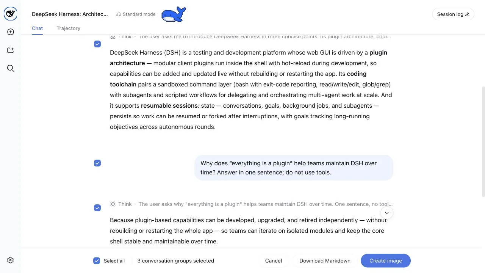
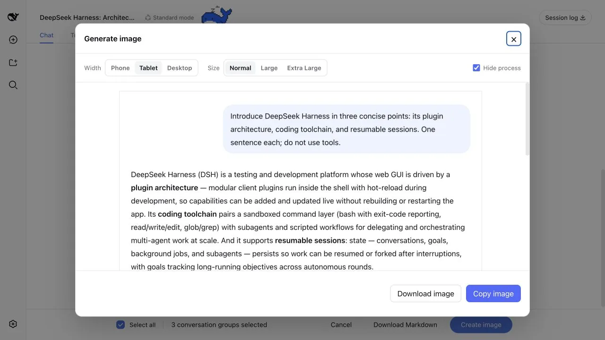

# dsh-share

[简体中文](./README.md) | English

Share DSH Q&As or selected conversation groups as PNG or Markdown.

Multi-select Q&As with the same interaction and experience as the DeepSeek web app.



Adjust the image width, font size, and process visibility before downloading or copying the result.



## Features

- Enters Q&A selection from the top-right action, with all groups selected by default
- The share action below any turn opens the same selection mode with only that Q&A preselected
- Shows linked checkboxes beside both the question and answer, lets you click content to select a group, and supports non-contiguous selection
- Keeps a checkbox visible while scrolling through long content, then lets it leave at that question or answer's boundary
- Supports image copy, PNG download, and Markdown download
- Preserves Markdown, code blocks, tables, images, and tool call summaries
- Supports adjustable image widths and font sizes, with a scrollable preview for long images
- Can hide reasoning and tool calls, leaving only the question and final answer

Performance testing: No impact on everyday chat by default. Runs on demand when sharing and is optimized for multi-turn conversations.

## Quick installation

Add the plugin to the Web Profile with the DSH CLI, then restart `dsh web`:

```sh
dsh plugin --profile web add dsh-share
```

## Other installation methods

Install a specific GitHub version:

```sh
dsh plugin --profile web add github:hellodigua/dsh-share#vX.Y.Z
```

Install from a local checkout:

```sh
dsh plugin --profile web add /absolute/path/to/dsh-share
```

After changing the source, run `corepack pnpm build`, then refresh the plugin with `dsh plugin --profile web add --force /absolute/path/to/dsh-share`.

## Development

You can install dependencies, run tests, and build the project without a local DSH checkout:

```sh
corepack pnpm install --frozen-lockfile
corepack pnpm typecheck
corepack pnpm test
corepack pnpm build
```

Run the full check with one command:

```sh
corepack pnpm verify
```

DSH loads the files in `lib/` directly, so they must be committed with the source. After changing `src/`, rebuild and make sure `lib/` is up to date.

Run `corepack pnpm release:check` before a release. See [RELEASING.md](https://github.com/hellodigua/dsh-share/blob/main/RELEASING.md) for the GitHub-to-npm automation contract.

## Compatibility

Compatible with `@deepseek-ai/dsh ^0.1.0-rc.6`. Share actions use the official `conversation.chat.assistant-actions` and `conversation.session.header.utilities` slots, and do not scan or modify the action bar DOM. Selection mode adds checkboxes through `data-chat-flow-kind` and other stable `data-*` attributes, and does not depend on CSS Module class names; changes to the conversation structure may require a plugin update.

## Known limitations

- Copying an image requires clipboard permission. You can still download it if permission is unavailable.
- Unreadable remote resources are replaced with transparent placeholders.
- Only fully loaded Q&As can be selected. Scroll upward first to load older content.

## License

Licensed under the [MIT License](LICENSE). Licenses for dependencies bundled into the browser build are listed in [THIRD_PARTY_LICENSES.md](THIRD_PARTY_LICENSES.md).

## Links

Available on the [dshfind.com](https://dshfind.com) DSH plugin marketplace.
