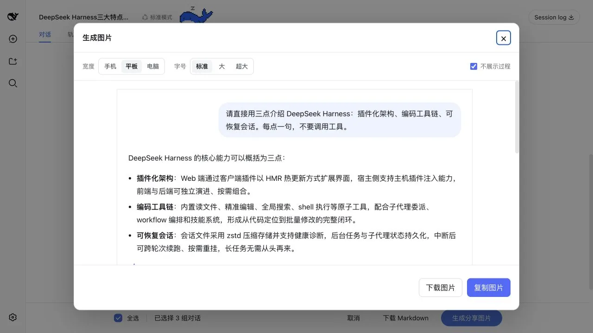

# dsh-share

把 DSH 中的一轮问答生成 PNG 图片，可直接复制到剪贴板或下载，不修改 DSH 核心代码。



## 功能

- 在每轮回答末尾的“复制 / 分支”操作区增加分享按钮
- 复用页面已经渲染好的 Markdown、代码块、表格和图片
- 默认按原始顺序保留 Think 与 Bash、Read、Search 等工具调用摘要，不包含展开输出
- 可勾选“不展示过程”，只保留本轮提问和最终回答，隐藏 Think、工具调用及中间步骤
- 支持复制 PNG 到剪贴板或下载到本地
- 支持手机 375px、平板 768px、电脑 1024px 三档宽度
- 支持标准 16px、大 18px、超大 20px 三档字号
- 长图在弹窗内保持可读宽度，通过纵向滚动预览
- 切换宽度或字号时保留旧图，新图生成并解码后原位替换
- 图片底部居中展示 DSH 官方“鲸鱼 + deepseek + HARNESS”品牌字标

新用户默认使用“平板 + 标准字号”并展示过程，PNG 按 2× 分辨率导出。宽度、字号和是否隐藏过程的偏好都保存在当前站点的浏览器 `localStorage` 中。

## 兼容性

当前版本在 DSH commit `0c47633c8aa1` 上完成构建、单元测试和 Web 实机验证。

DSH 暂时没有为消息操作区提供正式插件插槽。本插件通过 `MutationObserver` 和聊天页面的 `data-*` 属性找到按钮位置，因此 DSH 调整聊天 DOM 结构后，可能需要同步更新 `src/client/dom.ts`。

## 安装

### 从 GitHub tag 安装

建议固定版本，避免仓库后续更新改变已经安装的代码：

```sh
dsh plugin --profile web add \
  --ignore-scripts --config.auto-install-peers=false \
  'github:hellodigua/dsh-share#v0.1.0'
```

安装完成后重启 `dsh web`。

### 从本地 checkout 安装

```sh
git clone https://github.com/hellodigua/dsh-share.git
cd dsh-share

dsh plugin --profile web add \
  --ignore-scripts --config.auto-install-peers=false \
  .
```

修改源码后先运行 `corepack pnpm build`，再强制刷新 profile 中的本地包：

```sh
dsh plugin --profile web add --force \
  --ignore-scripts --config.auto-install-peers=false \
  .
```

### 从 `local-plugins` tarball 安装

仓库提交了预构建的 `lib/`，也可以打包成和 DSH `local-plugins` 目录中其他插件相同的 tarball：

```sh
corepack pnpm install --frozen-lockfile
corepack pnpm verify
mkdir -p ../local-plugins
corepack pnpm pack --pack-destination ../local-plugins
```

然后安装生成的文件：

```sh
dsh plugin --profile web add \
  --ignore-scripts --config.auto-install-peers=false \
  /absolute/path/to/local-plugins/dsh-external-dsh-share-0.1.0.tgz
```

tarball 已包含浏览器构建产物，安装时不需要执行第三方构建脚本。

## 开发

项目不依赖本机 DSH checkout 即可安装依赖、运行测试和构建：

```sh
corepack pnpm install --frozen-lockfile
corepack pnpm typecheck
corepack pnpm test
corepack pnpm build
```

也可以用一条命令执行完整检查：

```sh
corepack pnpm verify
```

`lib/` 是 DSH 直接加载的交付物，需要和源码一起提交。修改 `src/` 后，请重新构建并确认 `lib/` 已同步更新。

## 已知限制

- 复制图片依赖浏览器 Clipboard API；权限不足时仍可下载 PNG。
- 图片中的远程资源必须允许浏览器读取；无法读取的单个资源会用透明占位跳过，不影响整张 PNG 生成。
- 超长图片在其他聊天软件中仍可能被整体缩放；插件弹窗只负责提供可滚动的清晰预览。

## License

项目使用 [MIT](LICENSE) 许可证。浏览器 bundle 内联依赖的许可证见 [THIRD_PARTY_LICENSES.md](THIRD_PARTY_LICENSES.md)。
